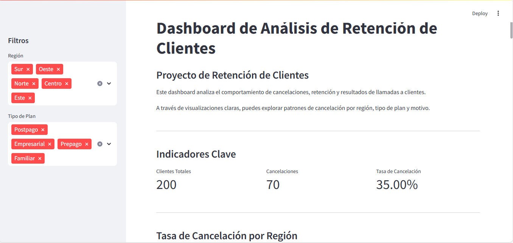

# Dashboard de Análisis de Retención de Clientes

Este proyecto es un **dashboard interactivo** desarrollado con **Python, SQLite y Streamlit**. Analiza datos ficticios de clientes, contratos, cancelaciones y llamadas de retención para identificar patrones de comportamiento y mejorar la fidelización.

## Capturas del Dashboard

> Aquí puedes añadir imágenes del dashboard en funcionamiento, por ejemplo:


)

---

## Características

- Visualización de tasa de cancelación por región y tipo de plan.
- Análisis de los motivos más comunes de cancelación.
- Estadísticas sobre la efectividad de llamadas de retención.
- Filtros interactivos por región, tipo de plan y fecha de alta.
- Exportación de datos filtrados a Excel.

---

## Tecnologías utilizadas

- **Python** (pandas, sqlite3, matplotlib, seaborn)
- **Streamlit** para la visualización web
- **Faker** para generación de datos sintéticos
- **SQLite** como motor de base de datos local

---

## Cómo ejecutar este proyecto

1. Clona este repositorio:
   ```bash
   git clone https://github.com/tu_usuario/dashboard-retencion.git
   cd dashboard-retencion
   ```

2. Instala las dependencias:
   ```bash
   pip install -r requirements.txt
   ```

3. Genera la base de datos:
   ```bash
   python ret_bd.py
   ```

4. Ejecuta el dashboard:
   ```bash
   streamlit run dashboard_portafolio.py
   ```

---

## Sobre el autor

**Bryan Carriel**  
Apasionado por el análisis de datos y el desarrollo web.  
Experiencia en atención al cliente, ventas y retenciones.  
Conocimientos en SQL, Python, JavaScript, HTML y CSS.

---

## Licencia

Este proyecto es de uso libre para fines educativos o demostrativos.
"# dashbord-retencion" 
